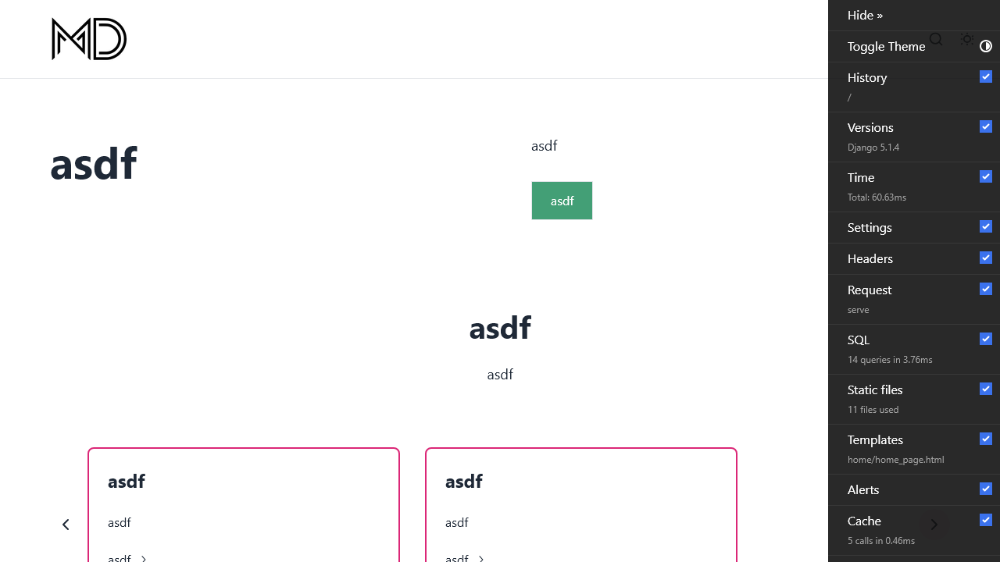

# 📚 White-Labeled Wagtail Blog & Portfolio

[](https://github.com/your-org/your-repo/actions)
[](LICENSE)
[](https://www.python.org/)
[](https://wagtail.org/)
[](https://tailwindcss.com/)

---

## 🖼️ Screenshot


<p align="center"><em>Default homepage – fully customizable</em></p>

---

## 🚀 Quickstart

```bash
# 1. Clone the repository
 git clone <your-repo-url>
 cd <project-folder>

# 2. Set up a virtual environment
 python -m venv .venv
 source .venv/bin/activate  # On Windows: .venv\Scripts\activate

# 3. Install dependencies
 uv pip install -r requirements.txt

# 4. Copy and edit your .env file
 cp .env.example .env  # Or create .env as per docs

# 5. Set up the database and admin user
 uv run python manage.py migrate
 uv run python manage.py createsuperuser

# 6. Install and build Tailwind CSS
 uv run python manage.py tailwind install
 uv run python manage.py tailwind build

# 7. Collect static files
 uv run python manage.py collectstatic

# 8. Run the development server
 uv run python manage.py runserver
```

For full deployment, Docker, and Heroku instructions, see [docs/DEPLOYMENT.md](docs/DEPLOYMENT.md).

---

## 🧩 Project Features
- **Modular apps:** blog, portfolio, CV, timeline, home, base, search, theme
- **Flexible content:** Highly customizable StreamField blocks
- **Modern styling:** Tailwind CSS integration
- **Media storage:** Cloudinary support (optional)
- **Deployment:** Docker, Heroku, and manual options
- **Admin UI:** Manage content, users, and settings via Wagtail
- **Custom navigation, header/footer, and social links**
- **Comprehensive documentation**

---

## 📖 Documentation
Comprehensive guides are available in the `docs/` folder:

- [**DEPLOYMENT.md**](docs/DEPLOYMENT.md): Step-by-step instructions for installing, configuring, and deploying the application. Includes quickstart, production checklist, troubleshooting, and more.
- [**CUSTOMISATION.md**](docs/CUSTOMISATION.md): How to rebrand, modify templates, extend blocks, and adjust the site to your needs. Includes best practices and walkthroughs.
- [**OPERATION.md**](docs/OPERATION.md): Day-to-day operation, content management, user roles, workflow, backups, and troubleshooting.
- [**claude.md**](docs/claude.md): Context and best practices for AI agents and automation tools working on this project.

For further details, refer to each guide or consult the official [Wagtail documentation](https://docs.wagtail.org/) and [Django documentation](https://docs.djangoproject.com/).

---

## 🤝 Contributing
Pull requests are welcome! For major changes, please open an issue first to discuss what you would like to change. See [claude.md](docs/claude.md) for AI/automation context and best practices.

---

## 📝 License
This project is licensed under the MIT License. See the [LICENSE](LICENSE) file for details. 